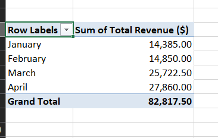
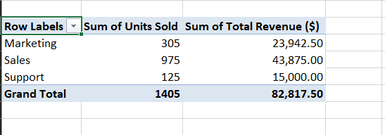
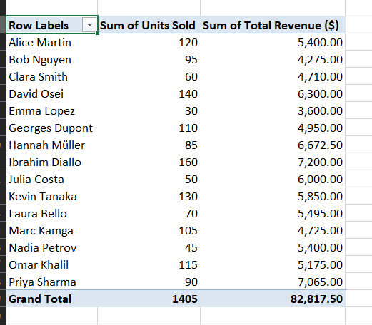

# employee-performance-analysis
This project analyzes employee performance data using Excel to uncover key business insights such as revenue trends, departmental performance, and monthly sales patterns. This project was just to test my understanding of Microsoft Excel , being the Second most demand skill for data Analysis.

# Introduction
This project analyzes employee sales data to uncover key business insights using Excel and simple data analysis techniques. The goal is to understand performance by employee, department, and month, then use those insights to support better business decisions.

The dataset contains employee names, departments, months, units sold, unit prices, and total revenue. Using this data, I explored patterns in revenue growth, top-performing employees, department contribution, and monthly trends.

## Business Questions
The analysis was built around 40 business questions, including:

1)Which employee generated the highest total revenue?

2)Which employee generated the lowest total revenue?

3)Which department sold the most units overall?

4)Which department generated the highest total revenue overall?

5)Which month had the highest total revenue?

6)Which month had the lowest total revenue?

7)Which month recorded the highest total units sold?

8)Which month recorded the lowest total units sold?

9)Which employee sold the highest number of units?

10)Which employee sold the fewest units?

11)Which employee had the highest unit price?

12)Which employee had the lowest unit price?

13)How does Sales department performance compare with Marketing and Support?

14)Which department has the highest average units sold per employee?

15)Which department has the highest average revenue per employee?

16)Which department has the lowest average revenue per employee?

17)What is the overall total revenue for the period covered?

18)What is the overall total number of units sold?

19)What is the average revenue per employee?

20)What is the average units sold per employee?

21)What is the average unit price across all records?

22)Which employees consistently performed above the overall average revenue?

23)Which employees performed below the overall average revenue?

24)Are there noticeable revenue differences between departments because of unit price or volume?

25)Which month shows the strongest sales momentum?

26)Which month shows a decline in performance compared with the previous month?

27)Do higher units sold always correspond to higher revenue in this dataset?

28)Which employees generated high revenue despite selling fewer units?

29)Which employees sold many units but still generated comparatively lower revenue?

30)Which department appears most sensitive to unit price changes?

31)Which employee or department contributed the most to revenue stability?

32)Is there a pattern in performance by department across months?

33)Which employees are top performers when ranked by revenue?

34)Which employees are top performers when ranked by units sold?

35)Which month had the best balance between units sold and revenue?

36)Which department has the widest spread in employee performance?

37)Which employee records are most likely candidates for incentive or bonus recognition?

38)Which employees may need coaching or support based on low output?

39)How evenly is revenue distributed across employees?

40)What key operational insights can be used to improve future sales strategy?

### Examples of some Analysis

Revenue by Month: to identify monthly revenue trends and the best-performing month. 

Revenue and Units by Department: to compare Sales, Marketing, and Support across performance metrics.

Employee Performance Summary: to identify top and low performers based on revenue and units sold.

# Insights
The business is performing well because revenue increases over the period. Among the three departments, Sales is the strongest overall, and the employee who generated the highest revenue also works in Sales. The department should continue focusing on volume, since high unit sales drive revenue even with a lower unit price. Although Marketing has the highest average revenue per employee, Sales remains the best department in total output, so improving employee skills across departments would be a major advantage. Support is the weakest-performing department despite having the highest unit prices, which suggests that increasing volume could significantly improve revenue. Support employees should therefore receive coaching or training from top performers. Finally, April was the best month, so it would be useful to understand what drove that performance and repeat it in future periods.

# Conclusion
This project shows how simple Excel analysis can reveal strong business insights from a small dataset. By combining PivotTables with targeted business questions, it becomes easier to identify top performers, weak areas, and growth opportunities.

The main business decision from this analysis is to continue strengthening Sales, improve coaching for lower-performing employees, and study what drove the strong performance in April so it can be repeated in future periods.
